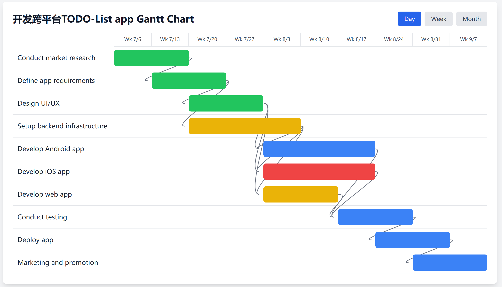

<div align="center">

# 🚀 task-cli – AI-Driven CLI Project Management & Gantt Chart Tool

**An open-source AI Agent that automatically decomposes tasks, generates Gantt charts, and provides project Q&A within your terminal.**

[](https://github.com/sunjiawe/task-cli/stargazers)
[](https://github.com/sunjiawe/task-cli/blob/main/LICENSE)
[](https://www.python.org/downloads/)

English | [中文文档](./README_ZH.md)

</div>

> **In a nutshell**  
> task-cli leverages an LLM to handle **AI project management** from the command line: automatically generating task lists, interactive Gantt charts, and real-time Q&A.

## 🔍 Use Cases
| Scenario | Traditional Method | The task-cli Advantage |
|---|---|---|
| Requirements Analysis | Manually breaking down tasks | **AI-powered decomposition** of complex requirements into executable sub-tasks |
| Progress Tracking | Manual updates in Excel/Notion | **One-click Gantt chart generation** for real-time timeline visualization |
| Project Q&A | Searching through documents | **Natural language conversation** to quickly retrieve project information |


## ✨ Core Features
- 🤖 **AI Task Decomposition** – Based on high-level objectives, utilizes an LLM to automatically break down complex tasks into executable sub-tasks. Supports multi-turn dialogue to continuously refine the generated task plan.
- 📊 **Interactive Gantt Charts** – Automatically generates HTML Gantt charts, making task dependencies clear and intuitively tracking project progress.
- 💬 **Intelligent Project Q&A** – Chat with your project database using natural language queries.
- 🔧 **Rich CLI Commands** – `init`, `decompose`, `gantt`, `report` cover the entire project lifecycle.
- 🌍 **Language Support** – The agent can be configured to respond in the user's preferred language.

---

## 🚀 Quick Start

### 1. Installation

```bash
# Clone the repository
git clone https://github.com/sunjiawe/task-cli.git
cd task-cli

# Create a virtual environment (optional)
python -m venv venv && source venv/bin/activate  # Windows: venv\Scripts\activate

# Install dependencies
pip install -r requirements.txt
```

## 📖 Detailed Usage Guide

### 1. Initialize a Project

Use the `init` command to start a new project:

```bash
python main.py init
? Enter project name: Cross-platform To-Do App
? Enter project goal: All software features are fully functional
```

### 2. Start the Project Assistant

Before use, you need to configure the `DEEPSEEK_API_KEY` environment variable to use the LLM's API.

After initialization, run the program to enter the assistant terminal:
```
set DEEPSEEK_API_KEY="your-api-key"
python main.py
```

## 📖 Command Details

Type `/` to trigger subcommand autocompletion.

| Command | Description | Example |
|---|---|---|
| `/decompose <req>` | AI Task Decomposition | `/decompose Develop a cross-platform to-do app` |
| `/list` | View the task list | `/list` |
| `/howto <id>` | Get guidance on a task | `/howto design-ui` |
| `/update <id>` | Update task status | `/update design-ui done` |
| `/gantt` | Generate a Gantt chart | `/gantt` |
| `/report` | Generate a project summary | `/report` |
| `/qa <question>` | Project Q&A | `/qa What tasks are due this week?` |
| `/help` | Display help | `/help` |

> **Debug Mode**: Set the environment variable `DEBUG_MODE=true` to view LLM request details.

---

## 🎯 Examples

### 1. Task Decomposition
```
> /decompose Develop a cross-platform to-do app
✅ Decomposed into 8 sub-tasks. View with /list
```

### 2. Generate Gantt Chart
```
> /gantt
📊 Gantt chart saved to gantt.html
```
Open `gantt.html` to see the interactive timeline:



### 3. Others

```bash
# Ask the assistant for guidance on executing a single task
/howto 

# Update task status
/update

# Project summary report
/report

# Ask any questions about the project in natural language
/qa

# Display help information
/help
```
---

## 🤝 Contributing

All forms of contribution are welcome!

- Found a Bug → [Submit an Issue](https://github.com/sunjiawe/task-cli/issues)  
- Feature Suggestion → [Start a Discussion](https://github.com/sunjiawe/task-cli/discussions)  
- Code Contribution → Submit a Pull Request

---

## 📄 License

This project is licensed under the Apache 2.0 License.
[Apache 2.0](./LICENSE) © 2025 sunjiawe

## 🙏 Acknowledgments

- [Pocket Flow](https://github.com/The-Pocket/PocketFlow) - The minimalist Agent framework that drives this project.
- [gemini-cli](https://github.com/google-gemini/gemini-cli) - An open-source AI agent that brings the power of Gemini directly into your terminal.

---

<div align="center">

⭐ If task-cli is helpful to you, please give it a Star!  
💬 For any questions, feel free to [open an issue](https://github.com/sunjiawe/task-cli/issues/new) or join the discussion.

</div>