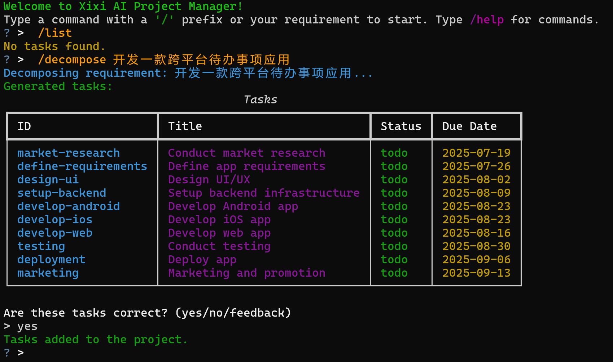

<div align="center">

# 🚀 task-cli – AI 驱动的 CLI 项目管理与甘特图工具

**一个开源的 AI Agent，可在终端中自动分解任务、生成甘特图并提供项目问答。**

[](https://github.com/sunjiawe/task-cli/stargazers)
[](https://github.com/sunjiawe/task-cli/blob/main/LICENSE)
[](https://www.python.org/downloads/)

[English](./README.md) | 中文文档



</div>

> **一句话介绍**  
> task-cli 利用 LLM 在命令行中完成 **AI 项目管理**：自动生成任务清单、交互式甘特图、实时问答。


## 🔍 使用场景
| 场景 | 传统做法 | task-cli 的优势 |
|------|----------|-----------------|
| 需求梳理 | 手动拆分任务 | **AI 自动分解**复杂需求为可执行子任务 |
| 进度跟踪 | Excel/Notion 手动更新 | **一键生成甘特图**实时可视化时间线 |
| 项目问答 | 翻阅文档 | **自然语言对话**快速获取项目信息 |


## ✨ 核心特性
- 🤖 **AI 任务分解** – 基于高阶目标，利用 LLM 自动将复杂任务分解为可执行的子任务。支持多轮对话调整生成的任务规划。
- 📊 **交互式甘特图** – 自动生成 HTML 甘特图，任务依赖一目了然、直观地跟踪项目进度 
- 💬 **项目智能问答** – 与项目数据库对话，支持自然语言查询  
- 🔧 **丰富的 CLI 命令** – `init`, `decompose`, `gantt`, `report` 覆盖项目全生命周期  
- 🌍 **语言支持** – 可配置agent以用户习惯的language进行答复

---

## 🚀 快速开始

### 1. 安装

```
pip install task-cli-tool

# 测试命令
task-cli
```

## 📖 详细使用指南

### 1. 初始化项目

使用 `init` 命令开始一个新项目：

```bash
task-cli init
? Enter project name: 跨平台待办事项
? Enter project goal: 所有软件功能可正常使用
```

### 2. 启动项目助手

在使用之前，你需要配置环境变量`DEEPSEEK_API_KEY`才能正常使用LLM的api

项目初始化完成之后，运行程序进入助手终端：
```
set DEEPSEEK_API_KEY="your-api-key"
task-cli
```

## 📖 命令详解

输入 `/` 触发子命令的自动补全

| 命令 | 说明 | 示例 |
|------|------|------|
| `/decompose <需求>` | AI 任务分解 | `/decompose 开发一款跨平台待办事项应用` |
| `/list` | 查看任务清单 | `/list` |
| `/howto <id>` | 获取任务执行指南 | `/howto design-ui` |
| `/update <id>` | 更新任务状态 | `/update design-ui done` |
| `/gantt` | 生成甘特图 | `/gantt` |
| `/report` | 生成项目总结 | `/report` |
| `/qa <问题>` | 项目问答 | `/qa 本周有哪些任务到期？` |
| `/help` | 显示帮助 | `/help` |

> **调试模式**：设置环境变量 `DEBUG_MODE=true` 可查看 LLM 请求细节。

---

## 🎯 示例

### 1. 任务分解
```
> /decompose 开发一款跨平台待办事项应用
✅ 已拆解为 8 个子任务，见 /list
```

### 2. 生成甘特图
```
> /gantt
📊 甘特图已保存至 gantt.html
```
打开 `gantt.html` 查看交互式时间线：


### 3. 其他

```bash
# 咨询助手，对执行单一任务给与指导
/howto 

# 更新任务状态
/update

# 项目总结报告
/report

# 自然语言对话，询问关于项目的任何问题
/qa

# 显示帮助信息
/help
```
---

## 🤝 贡献指南
我们欢迎所有形式的贡献！

- 发现 Bug → [提交 Issue](https://github.com/sunjiawe/task-cli/issues)  
- 功能建议 → [开启 Discussion](https://github.com/sunjiawe/task-cli/discussions)  
- 代码贡献 → 提交 Pull Request


开发环境：
```bash
# 克隆仓库
git clone https://github.com/sunjiawe/task-cli.git
cd task-cli

# 创建虚拟环境（可选）
python -m venv venv && source venv/bin/activate  # Windows: venv\Scripts\activate

# 安装依赖
pip install -r requirements.txt
pip install -e .
task-cli
```

---

## 📄 许可证

本项目使用 Apache 2.0 许可证。
[Apache 2.0](./LICENSE) © 2025 sunjiawe

## 🙏 致谢

- [Pocket Flow](https://github.com/The-Pocket/PocketFlow) - 驱动本项目的极简 Agent 框架。
- [gemini-cli](https://github.com/google-gemini/gemini-cli) - An open-source AI agent that brings the power of Gemini directly into your terminal.

---

<div align="center">

⭐ 如果 task-cli 对你有帮助，请点个 Star！  
💬 有任何问题，欢迎 [提 Issue](https://github.com/sunjiawe/task-cli/issues/new) 或在 Discussions 中交流。

</div>