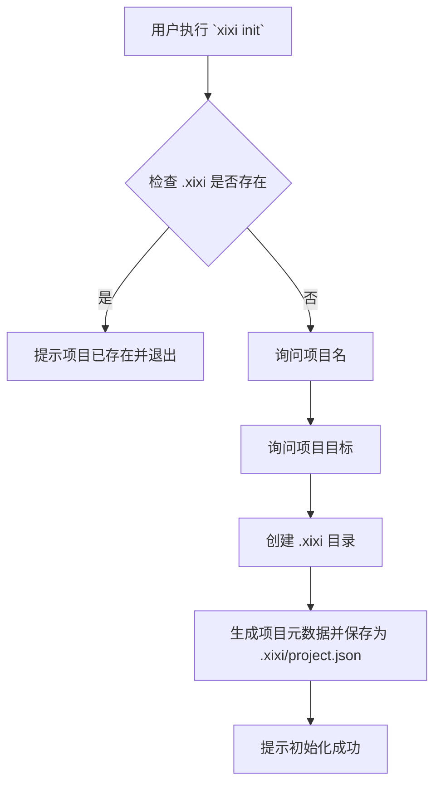

# 设计文档：Xixi - AI 项目管理助手

本文档遵循 [Agentic Coding 指南](../GEMINI.md) 来设计和实现 Xixi 项目。

## 1. 需求

我们需要一个命令行项目管理助手，名为 Xixi。核心需求如下：

- **项目初始化**: 能在任意目录通过 `init` 子命令创建项目，并记录项目名称和目标。
- **数据存储**: 所有项目数据存储在当前路径的 `.xixi` 目录下，类似于 `.git`。
- **交互式终端**: 应用启动后进入一个多轮对话终端，通过 `/` 前缀的子命令与助手交互。
- **任务拆解**: 核心功能。能将用户的复杂需求拆解为可执行的任务和子任务，并评估难度、工时、截止日期和依赖关系。
- **任务管理**:
  - `/list`: 查看任务列表。
  - `/howto`: 获取具体任务的执行建议。
- **项目洞察**:
  - `/report`: 生成标准化的项目报告。
  - `/qa`: 基于项目数据，智能回答用户提问。
- **程序控制**:
  - `/quit`: 退出应用。

## 2. 流程设计 (Flow Design)

应用的核心流程分为两部分：初始化流程和主交互流程。

### 初始化流程 (`init`)



### 主交互流程 (REPL)

```mermaid
graph TD
    subgraph "启动"
        A[用户执行 `xixi`] --> B{检查 .xixi 是否存在};
        B -->|否| C[提示需要初始化并退出];
        B -->|是| D[加载项目数据];
    end

    subgraph "主循环 (REPL)"
        D --> E[进入交互式终端];
        E --> F[等待用户输入];
        F --> G{输入是否为 /subcommand?};
        G -->|是| H[执行对应子命令];
        G -->|否| I[作为需求输入，进行任务拆解];
        H --> E;
        I --> E;
    end

    subgraph "子命令"
        H --> H_list[/list];
        H --> H_howto[/howto];
        H --> H_report[/report];
        H --> H_qa[/qa];
        H --> H_quit[/quit];
    end

    H_quit --> J[退出程序];
```

## 3. 工具 (Utilities)

- `storage.py`: 封装所有对 `.xixi` 目录的读写操作。
  - `init_project(name, goal)`: 初始化项目文件结构。
  - `load_project()`: 加载项目数据。
  - `save_tasks(tasks)`: 保存任务列表。
  - `load_tasks()`: 加载任务列表。
- `llm_api.py`: 封装与大语言模型交互的接口。
  - `decompose_requirement(requirement, project_context)`: 拆解需求。
  - `get_task_advice(task, project_context)`: 为任务生成建议。
  - `generate_report(project_context)`: 生成报告。
  - `answer_question(question, project_context)`: 回答问题。
- `display.py`: 负责格式化输出，例如以表格形式打印任务列表。

## 4. 数据设计 (Data Design)

所有数据以 JSON 格式存储。

### `.xixi/project.json`
存储项目的基本信息。

```json
{
  "project_id": "uuid-v4-string",
  "project_name": "项目名称",
  "project_goal": "项目目标",
  "created_at": "iso-timestamp"
}
```

### `.xixi/tasks.json`
存储任务列表。

```json
[
  {
    "task_id": "short-unique-id-1",
    "title": "任务标题",
    "description": "任务的详细描述",
    "status": "todo" | "in_progress" | "done",
    "difficulty": 1, // 1-5
    "estimated_hours": 8,
    "due_date": "YYYY-MM-DD",
    "dependencies": ["short-unique-id-2"], // 依赖的任务ID列表
    "sub_tasks": [
        // 可以在此嵌套子任务结构，或通过 parent_id 关联
    ],
    "created_at": "iso-timestamp",
    "updated_at": "iso-timestamp"
  }
]
```

## 5. 节点设计 (Node Design)

虽然这是一个 CLI 应用而非 PocketFlow 流程，但我们可以将每个命令看作一个独立的逻辑节点。

- **`InitNode`**:
  - `exec`: 执行初始化逻辑，与用户交互并调用 `storage.py`。
- **`ReplNode`**:
  - `exec`: 启动主循环，监听和分发用户命令。
- **`DecompositionNode`**:
  - `prep`: 收集用户输入的需求和当前项目上下文。
  - `exec`: 调用 `llm_api.decompose_requirement`。
  - `post`: 将返回的任务存入 `tasks.json` 并展示给用户。
- **`ListNode`**:
  - `prep`: 调用 `storage.py` 加载任务。
  - `exec`: 调用 `display.py` 格式化任务列表。
  - `post`: 打印结果。
- **`HowtoNode`**:
  - `prep`: 根据用户指定的 `task_id` 加载任务和项目上下文。
  - `exec`: 调用 `llm_api.get_task_advice`。
  - `post`: 打印建议。

## 6. 实现规划

1.  **环境搭建**: 创建 `main.py` 作为入口，`requirements.txt` 添加所需依赖（如 `rich` 用于美化终端输出，`questionary` 用于交互式提问）。
2.  **骨架先行**: 实现 `main.py` 的基本逻辑，包括 `init` 子命令的框架和主循环的启动检查。
3.  **数据层**: 实现 `utils/storage.py`，完成对 `.xixi` 目录的原子化读写操作。
4.  **命令实现**: 逐一实现 `/list`, `/quit` 等简单命令。
5.  **LLM 集成**: 实现 `utils/llm_api.py`，并完成核心的 `/howto`、任务拆解、`/qa` 和 `/report` 功能。
6.  **交互优化**: 使用 `rich` 和 `questionary` 优化输入输出体验，例如实现 `/` 的自动补全提示。

## 7. 示例文件结构

```
xixi-project/
├── .xixi/
│   ├── project.json
│   └── tasks.json
├── main.py           # 应用主入口
├── cli.py            # Click 或 Argparse 的命令定义
├── commands/
│   ├── __init__.py
│   ├── list.py
│   ├── howto.py
│   └── ...           # 其他命令模块
├── utils/
│   ├── __init__.py
│   ├── storage.py    # 数据存储
│   ├── llm_api.py    # LLM 调用
│   └── display.py    # 格式化输出
└── requirements.txt
```